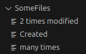
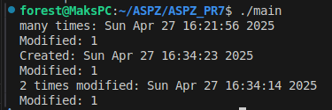

Метою даного проекту є розробка програми, що проаналізує чи була зміна файлу в директорії за останні 7 днів (якщо так, то коли саме), з використанням базових бібліотек на С. 

Для цього напишемо програму з використанням `dirent.h` для отримання файлів з директорії, `sys/stat.h` для отримання інформації про останню зміну файлу.

На початку цієї програми ми ініціалізуємо шлях до директорії, де будемо перевіряти файли.

Далі в `main` ми оголошуємо елемент з типом даних `DIR` та задаємо йому значення директорії й перевіряємо, чи доступна нам ця директорія.

Для перевірки файлів створюємо щосб по типу циклу, де для входу нам потрібен елемент `struct dirent *entry;` це така структура даних, що зберігає інформацію про директорію, за допомогою неї ми далі перевіряємо, чи не порожня директорія та уникаємо поточну та батьківську дирикторії, `strcmp(entry->d_name, ".") != 0` й `strcmp(entry->d_name, "..") != 0` відповідно.
Оскільки шлях до директорії та файли в ній в нас йдуть окремо, нам треба об'єднати їх в повний шлях до файлу `filePath`, й далі передаємо у функцію `check_file`, вона отримує шлях до файлу, отримує статистику про нього й цю інформацію.

Далі в нас йде функція `check_file`, вона створює статистику для файлу й перевіряє, чи існує він, чи є до нього доступ.

За допомогою бібліотеки `time.h` налаштовуємо час на 7 днів назад й звіряємо останню дату зміни файлу з цим часом, якщо зміна була, то `check` матиме відмінне від 0 значення.

Відповідно, якщо зміна була, то отримуємо дату, коли вона сталась для цього переводимо час в масив `char` елементів та додаємо строку про зміну до нього.

Файли маютьь такий вийляд:

Й після виконання програми отримуємо такі результати:

Таким чином, ми з'язували, коли була зроблена остання зміна файлу.

**Чи можна за допомогою типових бібліотек С отримати кількість змін файлу? Ні не можна,** оскільки ця інформація про файл не зберігається в системі й щоб обійти це, необхідно налаштовувати різні `слухачі`, що будуть працювати у фоні та підраховувати кількість змін.

Для цього проекту це не має сенсу, оскільки користувачу тут і зараз необхідно отримати цю інформацію а не рахувати в момент зміни.
